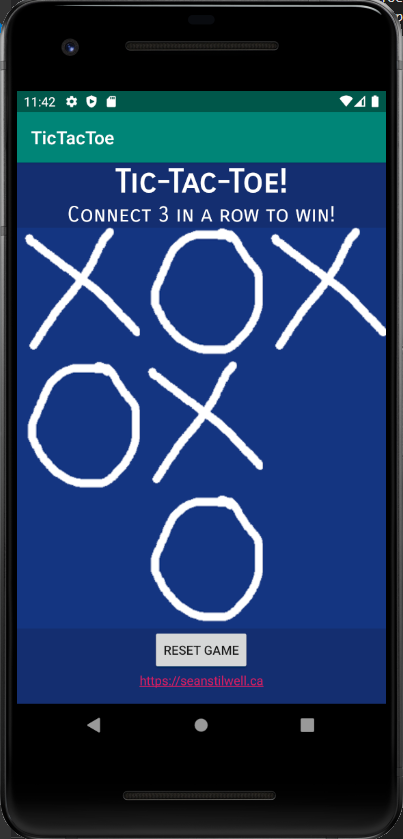
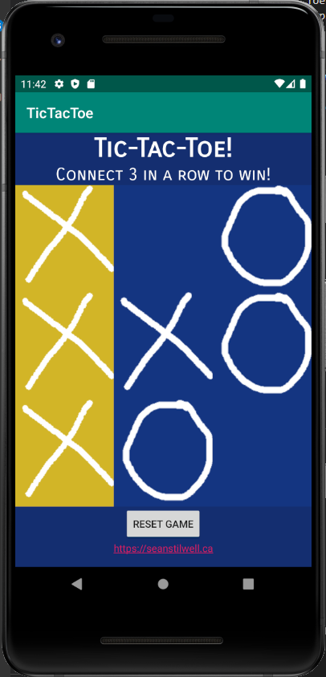

# Tic Tac Toe Android Application

A simple Tic Tac Toe game implemented in Android Studio and coded in Java. This is a simple version that allows games to be played.

## Screenshot

The UI of the game, with a game underway and a concluded game:

## Introduction

I made this application for fun in Android Studio, as well as to put my existing Java implementation to better use. It is built off the basic Java implementation in the repository.

## Features

Some features that are currently present:

* A graphical user interface to show the game status

* Ability to play a game of Tic Tac Toe on the GUI

* Determines when a game has been won or is inconclusive

* Ability to reset the game at any point