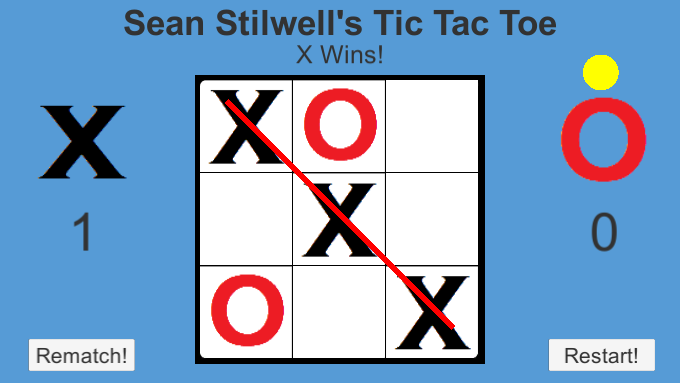

# Unity Implementation - Tic Tac Toe

A simple Tic Tac Toe game implemented using C# and Unity. This is a simple game that allows games to be played while keeping track of score & whose turn it is.

## Screenshot

The main UI of the game, with a sample game underway:

## Introduction

I made this application following my .NET version of the game, in order to teach myself Unity, as well as to improve on the model I had created before for playing the game.

## Features

Some features that are currently present:

* A graphical user interface to show the game status

* Ability to play a game of Tic Tac Toe on the GUI

* Keeps track of the scores during a session

* Ability to reset the score or board at any point

* Indicator to show whose turn it is (to avoid mistakes)

## User Guide

In order to run this game, currently just download the repository and run via the Unity Editor. The game may eventually be hosted on my personal website.